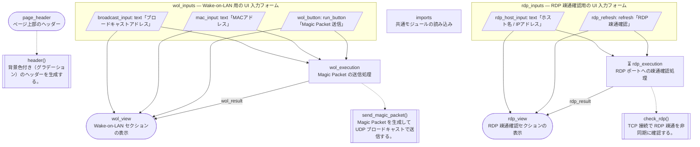

# magic_packet フロー図

`task flow` による自動生成ファイルです。手動で編集しないでください。ソース: `src/apps/magic_packet.py`

## 凡例

| 形 | 意味 |
|---|---|
| 四角 | 処理を行うセル |
| 角丸 (スタジアム形) | 何も定義せず画面表示だけを行うセル |
| 枠 (サブグラフ) | UI 要素を定義するセル |
| 平行四辺形 | UI 要素 (`mo.ui.*`) |
| 二重枠 | プロジェクト内の関数・クラスの呼び出し (点線) |
| ⏳ | async セル |
| 実線の矢印 | 変数の受け渡し (ラベルは変数名) |

## 検査結果

指摘なし
